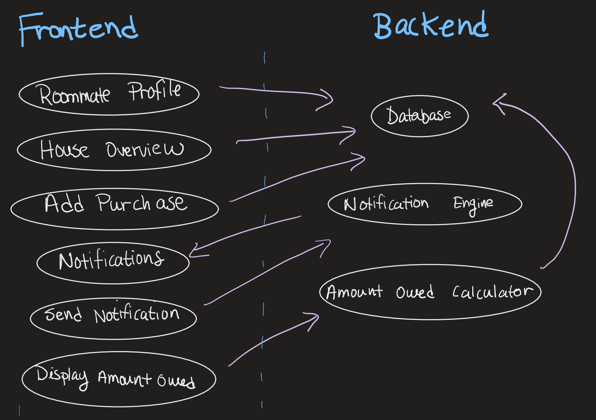

#### CPEN 321 M4: Design

Madeline Ferguson, Alyssa da Costa, Jackson Dagger, Sam Schweigel

# One Roof Design

1. Modules

   1. Backend 
      1. **Database**: To store purchase information such as purchaser, amount and receipt photo.
      2. **Notification Engine**: To take requests for notifications of owed money and and send them to the correct roommate.
      3. **Amount Owed Calculator**: To figure out who id owed/owes and how much.
   2. Frontend 
      1. **Notifications**: To display notifications.
      2. **Send Notification**: To send notifications of owed money.
      3. **Display Amount Owed**: To display who owes whom how much.
      4. **Roommate Profile**: To edit your profile.
      5. **House Overview**: To view your roommates' profiles.
      6. **Add Purchase**: To add purchases.

2. Interfaces (ADD TO THIS)
   1. **Database**
      1. `addPurchase(PurchaseInfo)`
      2. `PurchaseInfo[] getAllPurchases()`
      3. `addRoommate(RoommateInfo)`
      4. `modifyRoommate(RoommateId, RoommateInfo)`
      5. `removeRoommate(RoommateId)`
   2. **Notification Engine**
      1. `sendNotification(RoommateId, AmountOwed)`
   3. **Amount Owed Calculator**
      1. `List<RoomatePairOwing> getAmountsOwed()`
   4. **Notifications**
      1. `displayNotifications()`
   5. **Send Notification**
      1. `sendNotification(RoommateId)`
   6. **Display Amount Owed**
      1. `displayAmountOwed()`
   7. **Roommate Profile**
      1. `editProfile(RoommateId, RoommateInfo)`
   8. **House Overview** 
      1. `displayRoommates()`
   9. **Add Purchase**
      1. `addPurchase(RoommateId, PurchaseInfo)`

3. Diagram (CHANGE THIS)

   

4. Architectural Patterns
   1. Client-Server: This was a good choice to separate the data storage (stays on the server) and the user interface (stays on the client).
   2. The server will have RESTFull services because it will store state.

5. Languages and Frameworks
   1. For the front-end, we will use Android/Java because React-Native is too complicated for an Android only app.
   2. For the back-end database, we will use MySQL instead of MongoDB because our data (Roommates and Purchases) can be modeled easily by their relationships. 

6. Non-functional Requirements
>  Only authorized sources can view user information: This is a requirement because it's 
>  important to the users that their information is safe.

We will achieve this by using Google authentication to protect user data.

>  Maximum group size is 10 people: This is a requirement because we don't want
>  groups of more than 10 roommates per house.

We will achieve this by returning an error message when a house tries to add an 11th roommate.

>  Calculating how much every one is owed/owes should take no longer than 1s:
>  This is a requirement because we don't want users to leave the app while it's
>  calculating.

We will achieve this by caching the calculated values on the backend.

7. Complex logic (CHANGE THIS)
   1. No inputs
   2. Outputs a list containing instances of roommates owing other roommates.
      1. Example output: `[ { Owed: Roommate1, Owing: Roommates2, Amount: $20},  { Owed: Roommate2, Owing: Roommates3, Amount: $50 } ]`
   3. Works by querying the purchase data and calculating the total amount spent on shared items, dividing that by the number of roommates and then calculating the difference between that value and what each roommate spent and then calculating how much everyone is owed.
