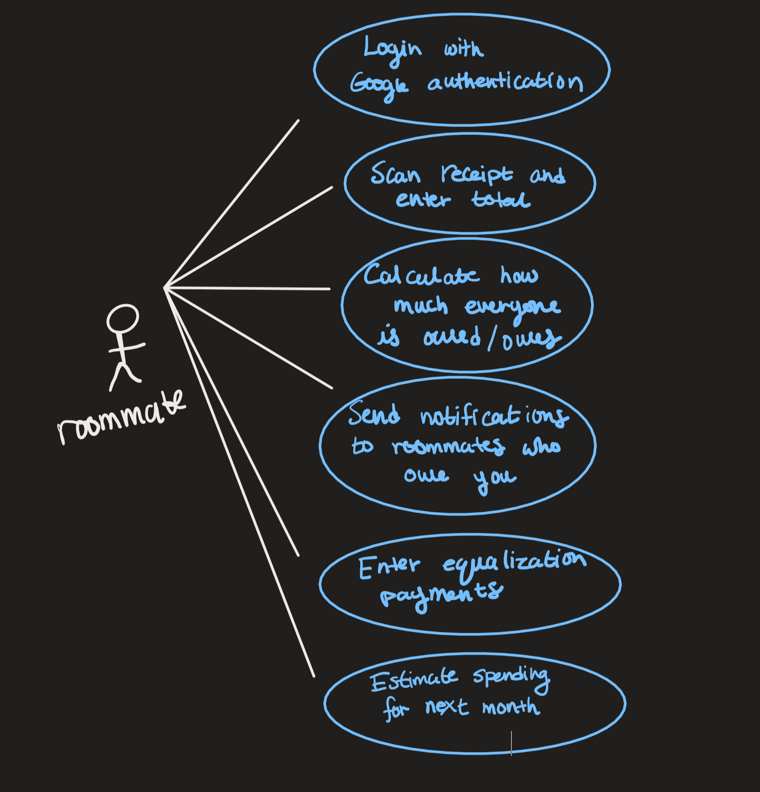
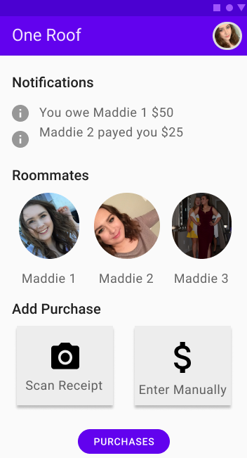

#### M3 Requirements CPEN 321

Madeline Ferguson, Alyssa da Costa, Jackson Dagger, Sam Schweigel

# One Roof Requirements

1. Description:

   As students living in an expensive city, we face the problem of inflated living expenses; lots of us mitigate these costs by living with one or more roommates. This brings up another problem: how are we going to keep track of these shared expenses? I propose One Roof as a solution to this problem. The app will be targeted at groups of individuals who live together. After making accounts through Google authentication, this app will allow the group to keep an inventory of shared purchases (through storage of receipt photos) and will use this data to figure out who owes who how much. When the roommates decide it's time to settle up, the app can send everyone a notification of how much is owed.

2. Use case diagram:

   

   

3. Non-functional requirements:

   1. Only authorized sources can view user information: Only members (or the owner, or a site admin) can request information from a house.  Only the owner, or a site admin can delete a house or change settings on it.
   2. The backend should be scalable: We should be able to spin up multiple instances of the server to handle more requests.  This implies that all state is stored in the database.
   3. Calculating how much every one is owed/owes should take no longer than 1s: This is a requirement because we don't want users to leave the app while it's calculating.

4. Main components:

   1. Backend 
      1. **Database**: To store purchase information such as purchaser, amount and receipt photo.
      2. **Notification Engine**: To take requests for notifications of owed money and and send them to the correct roommate.
      3. **Amount Owed Calculator**: To figure out who id owed/owes and how much.
      4. **Spending Predictor**: Predicts spending for the current month and compares with previous months.
   2. Frontend 
      1. **Notifications**: To display notifications.
      2. **Send Notification**: To send notifications of owed money.
      3. **Display Amount Owed**: To display who owes whom how much.
      4. **Roommate Profile**: To edit your profile.
      5. **House Overview**: To view your roommates' profiles.
      6. **Add Purchase**: To add purchases.

5. Sequence diagrams:

   1. Login with Google authentication (external API  call): 

      

      

   2. Predict next month's spending (non-trivial logic calculation):

      

      

   3. Send notifications to roommates who owe you (live update):

      

6. App Sketch:

